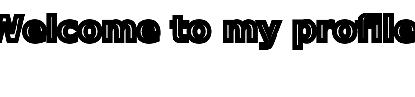

<!-- Header Section Starts -->

<!-- Header Section Ends -->

<!-- CV Section Starts -->

<!-- CV Section Ends -->

<!-- Intro Section Starts -->
<h1 style="color: #44AEFB;">
  👨🏻‍💻 Hey , I'm Mohamed Salem
</h1>

<!-- Intro Section Ends -->

<!-- Bio Section Starts -->
<h2 style="color: #44AEFB">📑 Bio:</h2>

  I am a passionate full-stack software developer who enjoys building applications and websites that make people's lives easier.
  I also enjoy teaching coding because I believe programming empowers people to solve problems and create opportunities.

  

 

  
  

  Feel free to connect with me — I'm always open to meaningful conversations and opportunities.

<!-- Bio Section Ends -->

  

<!-- Profile Views Section Starts -->
<h2 style="color: #44AEFB">🔍 GitHub Profile Views:</h2>

  

<!-- Profile Views Section Ends -->

 

 

<!-- Trophy Section Starts -->
<h2 style="color: #44AEFB">🏆 GitHub Profile Trophy:</h2>

  

<!-- Trophy Section Ends -->

<!-- About Me Section Starts -->
<h2 style="color: #44AEFB">
   About Me
</h2>

 

  

 

- 🎓 I graduated from [Faculty of Computers & Information Science](https://csifac.mans.edu.eg/index.php/en/) at [Mansoura University](https://www.mans.edu.eg/en) — Class of 2024.
- 🏆 I earned certificates from `IoT`, `ITI-ST`, `IBM`, and `Udemy`.
- 🧠 I enjoy using software as a solution for real-world problems.
- 💻 I practice competitive programming on `Codeforces` and `LeetCode`.
- 📚 I’m currently learning `MERN Stack`, `Design Patterns in JavaScript`, and `NoSQL Databases`.
- 🔭 I’m currently working on a **DEBI Internship Project**.
- 👯 I’m looking to collaborate on **Freelance Projects**.
- 🤝 I’m looking for help with **Improvement Projects**.
- 💬 Ask me about **HTML5, CSS3, JavaScript, React, Node.js, MongoDB, Tailwind CSS, Bootstrap, and SaaS**.
- 📫 Reach me at **mohamed.salem.dev.official@gmail.com**.
- ⚡ I’m open to fresh `tech challenges`.
- 🧾 Here is my [Resume](https://drive.google.com/file/d/1urziUnRAHfqF0IjgyuNLDR9aLQmu5sPx/view?usp=sharing), [Cover Letter](https://drive.google.com/file/d/1pTFD-nYk34pDFVhKmI4vPPNCI_12D44Z/view?usp=sharing), and [User Persona](https://drive.google.com/file/d/1elDofba9tq5mmQnZAkeTB2gr3bWla1me/view?usp=sharing).
- 🌐 Visit my [Portfolio Website](https://salems-space-portfolio.netlify.app/).

<!-- About Me Section Ends -->

<!-- Connect With Me Section Starts -->
<h2>📫 Let's Connect..!</h2>

  &nbsp;&nbsp;&nbsp;
  &nbsp;&nbsp;&nbsp;
  &nbsp;&nbsp;&nbsp;
  &nbsp;&nbsp;&nbsp;
  &nbsp;&nbsp;&nbsp;
  

<!-- Connect With Me Section Ends -->

<!-- Skills Section Starts -->
<h2> Skills</h2>
 

- **Languages**:  
  
  
  
  
  
  
  

   

- **Front-End Development**:  
  
  
  
  

   

- **Frameworks & Libraries**:  
  
  
  
  
  

   

- **Build Tools**:  
  

   

- **Databases**:  
  
  
  

   

- **Runtime & Backend**:  
  
  

   

- **Cloud & Hosting**:  
  
  
  

   

- **Software & Tools**:  
  
  
  
  
  
  

   

- **Hardware**:  
  
  
  
  

<!-- Skills Section Ends -->

<!-- Languages And Tools Section Starts -->

  
  
  
  
  
  
  
  
  
  
  
  
  
  
  
  
  
  

<!-- Languages And Tools Section End -->

<!-- GitHub Summary Section Starts -->

  

<!-- GitHub Summary Section Ends -->

<!-- Statistics Section Starts -->
<h2> Github Statistics: </h2>

 

  

 

<table align="center">
  <tr border="none">
    <td width="50%" align="center">
      
    </td>
    <td width="50%" align="center">
      
    </td>
  </tr>
</table>
<!-- Statistics Section Ends -->

<!-- Activity Graph Section Starts -->
<h2>📈 Latest Activity Graph</h2>
 
<h3 align="center">
   Latest Contribution
</h3>

  

<!-- Activity Graph Section Ends -->

 

<!-- Snake Game Starts -->
<h2>🐍 Contribution Snake</h2>

  

<!-- Snake Game Ends -->

<!-- Ending Starts -->

  
👋 <b>السَّلاَمُ عَلَيْكُمْ وَرَحْمَةُ اللهِ وَبَرَكَاتُهُ...✨</b>

<!-- Ending Ends -->

## Credits: [👤 Mohamed Salem](https://github.com/mosalem149)

Last Edited on: 08/07/2026

<!-- Footer Section Starts -->
<footer>
  <h2>© Footer:</h2>
  

    &copy; 2026 MoSalem149. All Rights Reserved.
  

</footer>
<!-- Footer Section Ends -->

<!-- Bottom Section Starts -->

<!-- Bottom Section Ends -->
